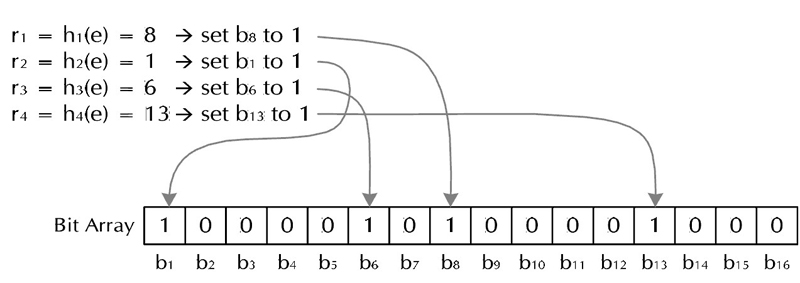

# java-master

## 布隆过滤器

布隆过滤器是由Bloom在1970年提出的一种多哈希函数映射的快速查找算法。通常应用在一些快速需要判断某个元素是否属于集合，但是并不严格要求100%正确的场合。

布隆过滤器存在的重要意义，可以用一个实例来说明。假设要写一个网络爬虫，由于网络间的链接错综复杂，爬虫在网络间的爬取很可能会形成“环”。为了避免形成“环”，就需要指导爬虫已经访问过哪些URL。给定一个URL，怎样能知晓这个是否已经被爬虫访问过呢？一般有如下几种解决方案：

- 将访问过的URL保存到数据库
- 用HashSet将访问过的URL保存起来，那只需接近O（1）的代价就可以查到一个URL是否被访问过
- URL经过MD5或SHA-1等单向哈希后在保存到HashSet或数据库
- BitMap方法，建立一个BitSet，将每个URL经过一个哈希函数映射到某一位

以上方法在数据量较小的情况下都能提供完美解决方案，但是当数据量变得非常庞大时问题就出现了。

方案一的缺点：数据量变得非常庞大后关系型数据库查询的效率会变得很低，而且每个URL就启动一次数据库查询有点小题大作；

方案二的缺点：太消耗内存。随着URL的增多，占用的内存会越来越多，就算只有一亿个URL，每个URL只算50个字符，就需要5GB内存；

方案三的缺点：由于字符串经过MD5处理后的信息摘要长度只有128比特，SHA-1处理后也只有160比特，因此方法三比方法二省了好几倍的内存；

方法四的内存消耗是相对较少的，但缺点是单一哈希函数发生冲突的概率太高。

实质上上面的算法忽略了一个重要的隐含条件：允许小概率的出错，不一定100%准确，也就是说少量URL实际上没有网络爬虫访问，而将它们判别错误为已访问的代价是很小的——少爬取几个网页。

###布隆过滤器算法

其实上面方法四的思想已经很接近布隆过滤器了，但是方法四的致命缺点是冲突概率高，为了降低冲突发生的概率，布隆过滤器使用了多哈希函数，而不是一个。其算法如下：

    创建一个m位BitSet，先将所有位初始化为0，然后选择k个不同的哈希函数。第i个哈希函数对字符串str哈希的结果即为h（i, str），且h（i, str）的取值范围为[0, m - 1]
    
（1）加入字符串过程

下面是每个字符串处理的过程，首先将字符串str记录到BitSet中的过程：对于字符串str，分别计算h（1，str），h（2，str），……，h（k，str）。然后将BitSet的第h（1，str），h（2，str），……，h（k，str）位设置为1，这样就将字符串str映射到BitSet中的k个二进制位了。

（2）检查字符串是否存在的过程

具体过程为：对于字符串str，分别计算h（1，str），h（2，str）…… h（k，str）。然后检查BitSet的第h（1，str）、h（2，str）…… h（k，str）位是否为1，若其中任何一位不为1则可以判定str一定没有被记录过。若全部位都是1，则“认为”字符串str存在。

若一个字符串对应的Bit不全为1，则可以肯定该字符串一定没有被Bloom Filter记录过。（这是显然的，因为字符串被记录过，其对应的二进制位肯定全部被设为1了）；

但是若一个字符串对应的Bit全为1，实际上是不能100%的肯定该字符串被Bloom Filter记录过的。（因为有可能该字符串的所有位都刚好是被其他字符串所对应）这种将该字符串划分错的情况，称为false positive 。

（3）删除字符串过程

字符串加入就不能被删除了，因为删除会影响到其他字符串。实在需要删除字符串的可以使用计数型布隆过滤器（CBF），这是一种基本布隆过滤器的辩题，CBF将基本布隆过滤器的每一个比特改为一个计数器，这样就可以实现删除字符串的功能了。

    布隆过滤器与单哈希函数Bit-Map的区别在于：布隆过滤器使用了k个哈希函数，每个字符串跟k个比特对应，从而降低了冲突发生的概率。
    
#### 布隆过滤器参数选择

（1）哈希函数选择

哈希函数的选择对性能的影响是很大的，一个好的哈希函数要能近似等概率的将字符串映射到各个比特位。选择k个不同的哈希函数比较麻烦，一种简单的方法就是选择一个哈希函数，然后传入k个不同的参数。

（2）比特位数组大小选择

哈希函数个数k、位数组大小m、加入的字符串数量n的关系可以参考[设置说明](http://pages.cs.wisc.edu/~cao/papers/summary-cache/node8.html)，该文献证明了给定的m、n好，当`k=ln(2)*m/n`时出错的概率是最小的。
